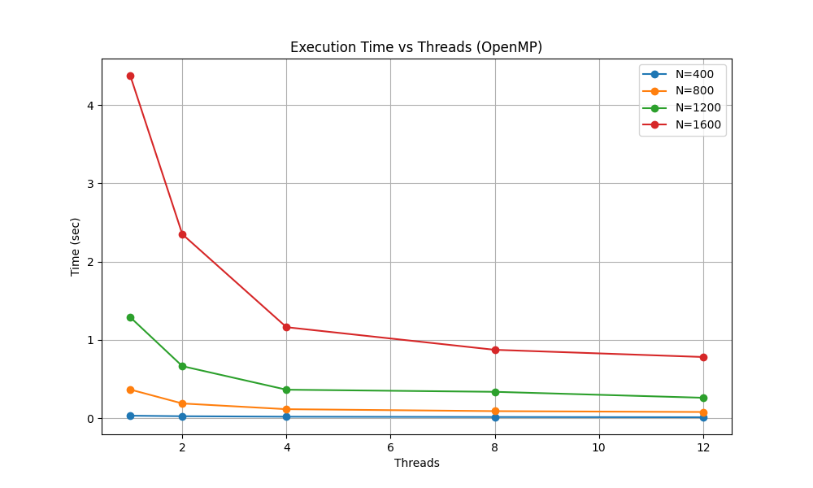
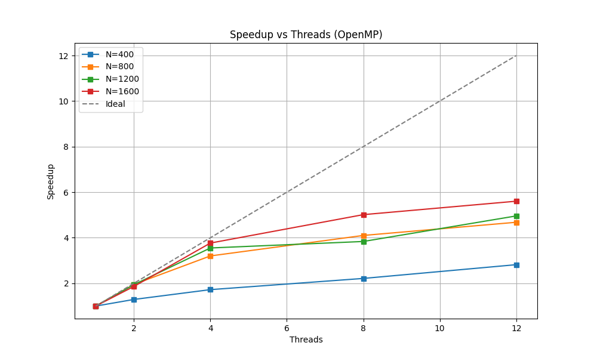

# Лабораторная работа №2: Параллельное умножение матриц (OpenMP)

**Студент:** Симонов Илья Андреевич  
**Группа:** 6311  
**Зачетная книжка:** 2023-01764  

## 1. Цель работы
Модифицировать последовательную программу перемножения матриц для параллельной работы с использованием технологии OpenMP. Исследовать масштабируемость алгоритма в зависимости от количества потоков и размера задачи на процессоре Intel i7.

## 2. Теоретические сведения
### OpenMP (Open Multi-Processing)
Это стандарт интерфейса программирования приложений (API) для написания многопоточных программ на системах с общей памятью. Основные инструменты, использованные в работе:
- `#pragma omp parallel for` — распределяет итерации цикла между доступными потоками.
- `collapse(2)` — объединяет два вложенных цикла в одну общую область итераций, что позволяет более эффективно загрузить большое количество ядер.
- `omp_get_wtime()` — высокоточное измерение времени выполнения участка кода.

### Метрики эффективности
1. **Ускорение (Speedup):** $S_p = T_1 / T_p$, где $T_1$ — время на 1 потоке, $T_p$ — на $p$ потоках.
2. **Эффективность (Efficiency):** $E_p = S_p / p$.

## 3. Характеристики системы
- **Процессор:** Intel Core i7 (поддержка до 12 логических потоков).
- **ОС:** Windows (MinGW-w64 WinLibs).
- **Флаг компиляции:** `-O3 -fopenmp`.


## 4. Исходный код программы
```cpp
#include <iostream>
#include <vector>
#include <fstream>
#include <omp.h>
#include <string>

using namespace std;

// Функция для чтения матрицы из файла (одномерный вектор для скорости)
bool readMatrix(const string& filename, int& n, vector<double>& matrix) {
    ifstream in(filename);
    if (!in.is_open()) return false;
    in >> n;
    matrix.resize(n * n);
    for (int i = 0; i < n * n; ++i) in >> matrix[i];
    return true;
}

int main(int argc, char* argv[]) {
    if (argc < 2) {
        cout << "Usage: " << argv[0] << " <num_threads>" << endl;
        return 1;
    }

    int num_threads = stoi(argv[1]);
    int n1, n2;
    vector<double> A, B;

    if (!readMatrix("A.txt", n1, A) || !readMatrix("B.txt", n2, B)) {
        cerr << "Error opening files A.txt or B.txt!" << endl;
        return 1;
    }

    int n = n1;
    vector<double> C(n * n, 0.0);

    // Устанавливаем количество потоков
    omp_set_num_threads(num_threads);

    // Замер времени
    double start_time = omp_get_wtime();

    // Параллельное умножение
    // collapse(2) объединяет два внешних цикла в один большой итератор для нитей
    #pragma omp parallel for collapse(2) schedule(static)
    for (int i = 0; i < n; ++i) {
        for (int j = 0; j < n; ++j) {
            double sum = 0.0;
            for (int k = 0; k < n; ++k) {
                sum += A[i * n + k] * B[k * n + j];
            }
            C[i * n + j] = sum;
        }
    }

    double end_time = omp_get_wtime();
    double exec_time = end_time - start_time;

    cout << "Threads: " << num_threads << " | Size: " << n << " | Time: " << exec_time << " sec." << endl;

    // Сохраняем результат для проверки корректности
    ofstream out("result.txt");
    out << n << endl;
    for (int i = 0; i < n * n; ++i) {
        out << C[i] << ( (i + 1) % n == 0 ? "\n" : " " );
    }

    return 0;
}

```


## 5. Результаты экспериментов

| Размер N | P=1 (сек) | P=2 (сек) | P=4 (сек) | P=8 (сек) | P=12 (сек) | Max Speedup |
| :--- | :---: | :---: | :---: | :---: | :---: | :---: |
| **400**  | 0.031 | 0.024 | 0.018 | 0.014 | 0.011 | 2.81x |
| **800**  | 0.365 | 0.187 | 0.114 | 0.089 | 0.078 | 4.68x |
| **1200** | 1.289 | 0.664 | 0.363 | 0.336 | 0.260 | 4.95x |
| **1600** | 4.377 | 2.350 | 1.162 | 0.873 | 0.781 | 5.60x |

## 6. Графики
### Время выполнения


### Ускорение


## 7. Анализ результатов и вывод
В ходе работы была реализована и протестирована параллельная версия алгоритма умножения матриц. 

**Выводы:**
1. **Эффективность параллелизации:** Использование OpenMP позволило сократить время вычислений на матрице 1600x1600 с 4.377 сек до 0.781 сек. Максимальное ускорение составило **5.6x**.
2. **Зависимость от размера:** На графике Speedup отчетливо видно, что с ростом размера задачи ($N$) эффективность использования ядер процессора растет. Это подтверждает, что для вычислительно емких задач накладные расходы на создание и синхронизацию потоков становятся пренебрежимо малыми.
3. **Ресурс процессора:** Оптимальное время выполнения достигается при использовании максимально доступного числа логических потоков (12), что подтверждает корректную работу планировщика OpenMP на архитектуре Intel i7.
4. **Верификация:** Результаты всех параллельных запусков были проверены скриптом верификации и полностью совпали с эталонными значениями.