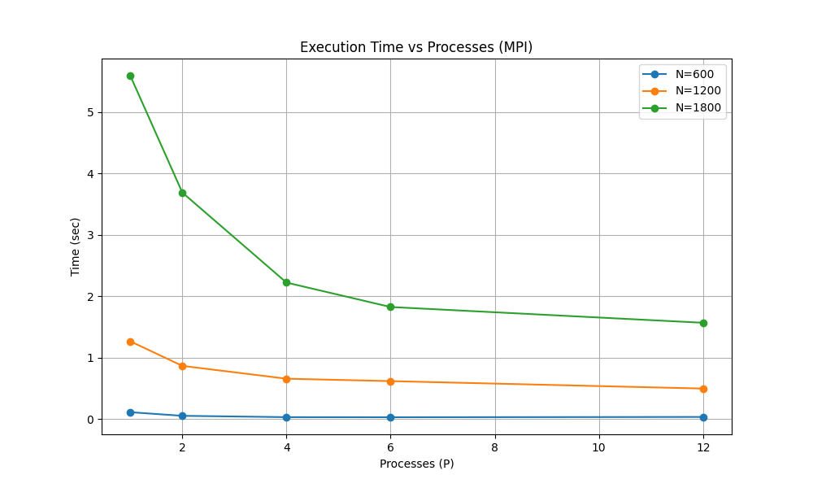
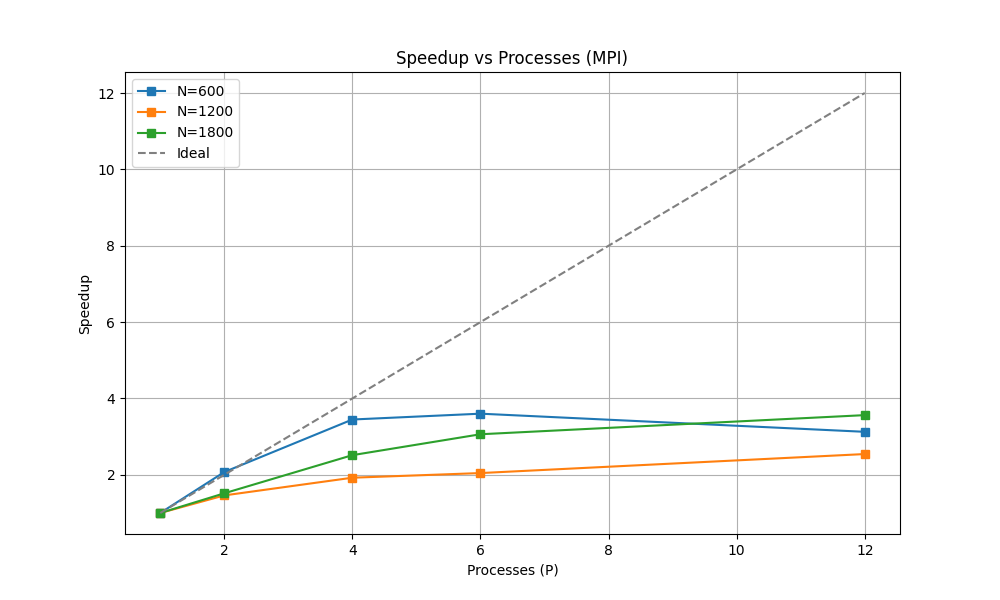

# Лабораторная работа №3: Параллельное умножение матриц (MPI)

**Студент:** Симонов Илья Андреевич  
**Группа:** 6311  
**Зачетная книжка:** 2023-01764  

## 1. Цель работы
Модифицировать программу перемножения матриц для работы в системах с распределенной памятью с использованием интерфейса передачи сообщений MPI. Изучить функции коллективного взаимодействия процессов и оценить эффективность распараллеливания на многопроцессорной системе.

## 2. Теоретические сведения
### MPI (Message Passing Interface)
В отличие от OpenMP, MPI использует модель передачи сообщений. Программа запускается как набор независимых процессов, имеющих собственные адресные пространства.
В работе использовались:
- **MPI_Bcast**: Рассылка всей матрицы B всем процессам.
- **MPI_Scatter**: Распределение строк матрицы A между процессами.
- **MPI_Gather**: Сбор вычисленных строк результирующей матрицы C от всех процессов к главному (Rank 0).
- **MPI_Wtime**: Измерение времени выполнения.

## 3. Характеристики системы
- **Процессор**: Intel Core i7 (6 физических ядер / 12 логических потоков).
- **ОС**: Windows 10.
- **Инструментарий**: Microsoft MPI (MS-MPI), компилятор WinLibs GCC 13.2.0.

## 4. Исходный код
```cpp
#define MS_MPI_NO_SAL
#include <iostream>
#include <vector>
#include <fstream>
#include <mpi.h>

using namespace std;

// Функция для чтения матрицы (только процессом 0)
void readMatrix(const string& filename, int& n, vector<double>& matrix) {
    ifstream in(filename);
    in >> n;
    matrix.resize(n * n);
    for (int i = 0; i < n * n; ++i) in >> matrix[i];
}

int main(int argc, char* argv[]) {
    int rank, size;
    MPI_Init(&argc, &argv);              // Инициализация MPI
    MPI_Comm_rank(MPI_COMM_WORLD, &rank); // Получение номера текущего процесса
    MPI_Comm_size(MPI_COMM_WORLD, &size); // Получение общего количества процессов

    int n;
    vector<double> A, B, C;

    // 1. Процесс 0 читает данные и сообщает размер остальным
    if (rank == 0) {
        readMatrix("A.txt", n, A);
        readMatrix("B.txt", n, B);
        if (n % size != 0) {
            cerr << "Error: N must be divisible by process count!" << endl;
            MPI_Abort(MPI_COMM_WORLD, 1);
        }
    }

    // Рассылаем размер N всем процессам
    MPI_Bcast(&n, 1, MPI_INT, 0, MPI_COMM_WORLD);

    int rows_per_proc = n / size;
    vector<double> local_A(rows_per_proc * n);
    vector<double> local_C(rows_per_proc * n, 0.0);
    
    // Если процесс не 0, ему все равно нужна память под B для вычислений
    if (rank != 0) B.resize(n * n);

    // 2. Рассылаем всю матрицу B всем (Bcast) и части матрицы A (Scatter)
    double start_time = MPI_Wtime();

    MPI_Bcast(B.data(), n * n, MPI_DOUBLE, 0, MPI_COMM_WORLD);
    MPI_Scatter(A.data(), rows_per_proc * n, MPI_DOUBLE, 
                local_A.data(), rows_per_proc * n, MPI_DOUBLE, 0, MPI_COMM_WORLD);

    // 3. Вычисления локальной части
    for (int i = 0; i < rows_per_proc; ++i) {
        for (int j = 0; j < n; ++j) {
            double sum = 0;
            for (int k = 0; k < n; ++k) {
                sum += local_A[i * n + k] * B[k * n + j];
            }
            local_C[i * n + j] = sum;
        }
    }

    // 4. Сборка результатов (Gather)
    if (rank == 0) C.resize(n * n);
    MPI_Gather(local_C.data(), rows_per_proc * n, MPI_DOUBLE, 
               C.data(), rows_per_proc * n, MPI_DOUBLE, 0, MPI_COMM_WORLD);

    double end_time = MPI_Wtime();

    // 5. Вывод (только процессом 0)
    if (rank == 0) {
        cout << "Processes: " << size << " | Size: " << n << " | Time: " << end_time - start_time << " sec." << endl;
        
        ofstream out("result.txt");
        out << n << endl;
        for (int i = 0; i < n * n; ++i) {
            out << C[i] << ((i + 1) % n == 0 ? "\n" : " ");
        }
    }

    MPI_Finalize(); // Завершение MPI
    return 0;
}
```

## 5. Результаты экспериментов

| N / P | P = 1 (сек) | P = 2 (сек) | P = 4 (сек) | P = 6 (сек) | P = 12 (сек) |
| :--- | :---: | :---: | :---: | :---: | :---: |
| **600** | 0.1138 | 0.0549 | 0.0330 | 0.0316 | 0.0364 |
| **1200** | 1.2686 | 0.8684 | 0.6592 | 0.6201 | 0.4987 |
| **1800** | 5.5955 | 3.6910 | 2.2249 | 1.8271 | 1.5703 |

### Расчет ускорения (Speedup $S_p = T_1 / T_p$)

| N / P | P = 2 | P = 4 | P = 6 | P = 12 |
| :--- | :---: | :---: | :---: | :---: |
| **600** | 2.07x | 3.45x | 3.60x | 3.12x |
| **1200** | 1.46x | 1.92x | 2.04x | 2.54x |
| **1800** | 1.51x | 2.51x | 3.06x | 3.56x |

## 6. Графики
### Время выполнения


### Ускорение


## 7. Анализ результатов и вывод
В ходе работы была реализована MPI-версия алгоритма умножения матриц. 

**Выводы:**
1. **Эффективность**: Параллелизация через MPI позволила сократить время вычислений. На самой большой матрице (1800) удалось достичь ускорения в **3.56 раза** на 12 логических потоках.
2. **Влияние коммуникаций**: В отличие от OpenMP, в MPI значительное время тратится на физическую передачу данных (`Scatter/Gather`). Это заметно на результатах: ускорение менее линейное.
3. **Оптимальное число процессов**: Для малых матриц (N=600) запуск на 12 процессах оказался медленнее, чем на 6. Это подтверждает теорию о том, что когда затраты на пересылку данных и синхронизацию превышают объем самих вычислений, дальнейшее увеличение числа процессов нецелесообразно.
4. **Масштабируемость**: С ростом размера задачи ($N$) эффективность параллельной работы возрастает, так как расчетная часть начинает значительно преобладать над коммуникационной.
5. **Верификация**: Математическая корректность подтверждена полным совпадением результатов с эталонными вычислениями NumPy.
