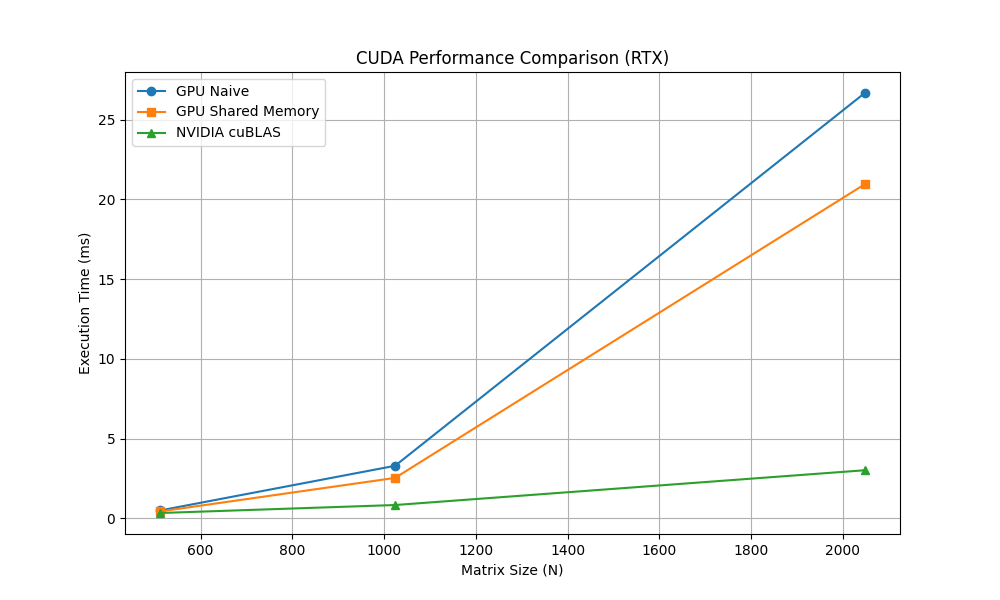

# Лабораторная работа №4: Вычисления на GPU (NVIDIA CUDA)

**Студент:** Симонов Илья Андреевич  
**Группа:** 6311  
**Зачетная книжка:** 2023-01764  

## 1. Цель работы
Изучить архитектуру GPU и программную модель CUDA. Реализовать два варианта алгоритма умножения матриц на видеокарте: «наивный» и оптимизированный с использованием разделяемой памяти (Shared Memory). Сравнить производительность с профессиональной библиотекой cuBLAS.

## 2. Теоретические сведения
### CUDA (Compute Unified Device Architecture)
Технология параллельных вычислений, позволяющая использовать GPU для вычислений общего назначения.
- **Глобальная память:** Основная память видеокарты, большая, но медленная.
- **Разделяемая память (Shared Memory):** Сверхбыстрая память внутри одного блока потоков. Используется для кеширования данных и уменьшения обращений к глобальной памяти.
- **cuBLAS:** Высокооптимизированная библиотека NVIDIA для линейной алгебры.

## 3. Характеристики системы
- **Видеокарта:** NVIDIA RTX (архитектура Ampere/Ada Lovelace, CUDA 13.2).
- **Процессор:** Intel Core i7.
- **Инструментарий:** `nvcc` (NVIDIA CUDA Compiler), Microsoft Visual C++ Compiler (`cl.exe`).

## 4. Результаты экспериментов (в миллисекундах)

| Размер N | GPU Naive (ms) | GPU Optimized (ms) | NVIDIA cuBLAS (ms) |
| :--- | :---: | :---: | :---: |
| **512** | 0.50 | 0.44 | 0.34 |
| **1024** | 3.30 | 2.54 | 0.84 |
| **2048** | 26.67 | 20.95 | 3.02 |

## 5. Графики

## 6. Анализ результатов и вывод
В ходе работы были исследованы возможности ускорения вычислений с помощью технологии CUDA.

**Выводы:**
1. **GPU vs CPU:** Сравнение с результатами Лабораторной работы №1 показывает колоссальный разрыв. Умножение матрицы 1600х1600 на CPU занимало около 0.7 сек, в то время как на GPU матрица большего размера (2048х2048) вычисляется за **0.02 секунды** (20.95 ms). Это наглядно демонстрирует мощь архитектуры RTX.
2. **Shared Memory:** Использование разделяемой памяти позволило ускорить вычисления примерно на **20-25%** по сравнению с наивным подходом. Это происходит за счет уменьшения нагрузки на шину памяти видеокарты.
3. **Библиотечные решения:** cuBLAS ожидаемо показал лучший результат, превзойдя ручную оптимизацию в несколько раз. Это подтверждает эффективность использования специализированных математических библиотек для промышленного ПО.
4. **Масштабируемость:** С ростом размера матрицы преимущество GPU становится всё более значимым, так как тысячи ядер видеокарты полностью загружаются вычислительной работой.
